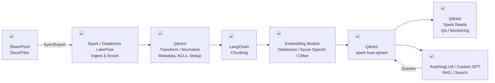

# SharePoint → Spark/Databricks → LangChain → Qdrant → Custom GPT

End-to-end workflow for ingesting SharePoint documents, embedding them, and serving retrieval-augmented experiences through Qdrant and a custom GPT front end (e.g., AnythingLLM).

## 1) Ingest & Transform (SharePoint → Spark / LakeFlow)
- Connect to SharePoint libraries; pull PDFs, DOCX, HTML, etc.
- Normalize content and metadata (titles, authors, paths, ACLs), dedupe, and clean text.
- Produce modeled DataFrames ready for embedding; schedule with LakeFlow for retries and lineage.

## 2) Chunk & Embed (LangChain + Embedding Providers)
- Chunk documents with LangChain (recursive/token-aware splitters) and keep SharePoint metadata alongside.
- Generate embeddings via:
  - Databricks Model Serving endpoints
  - Azure OpenAI (e.g., text-embedding-3 family)
  - Other OpenAI-compatible or local/vector engines
- Tune batch sizes, overlap, and retries to balance quality, cost, and throughput.

## 3) Persist to Qdrant (Vector Store)
- Write embeddings + payloads to Qdrant with the `spark-fuse-qdrant` connector.
- Optional auto-creation of collections based on inferred vector size; supports payload filtering and multiple payload formats.
- Read back with payload/vector selection, pagination, and retries for validation or analytics.

## 4) Retrieval & Applications (AnythingLLM / Custom GPT)
- AnythingLLM or a custom GPT front end queries Qdrant for retrieval-augmented generation and semantic search.
- Responses are grounded in SharePoint content with preserved metadata; enforce access control at query time if needed.
- Spark reads from Qdrant support QA, drift checks, and backfilling.

## Operating Considerations
- **Security**: Pass `api-key` headers for Qdrant Cloud; store credentials in secrets/key vaults.
- **Schema/quality**: Ensure non-null IDs and numeric vectors; validate chunking overlap and payload consistency.
- **Performance**: Tune `batch_size`, timeouts, and payload format; LakeFlow handles orchestration and retries.
